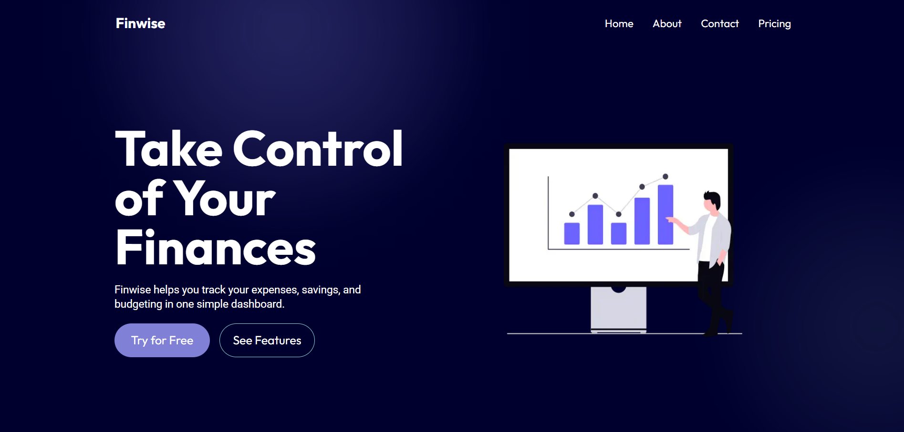

# 🌐 Finwise — Smart Finance Landing Page

Finwise is a modern, mobile-first finance landing page built with React and Tailwind CSS. It's designed to showcase a fintech or crypto-related product with sleek UI, animations, and performance in mind.

## 🔧 Tech Stack

- ⚛️ React (Component-based architecture)
- 💨 Tailwind CSS (Responsive, utility-first styling)
- 🖼️ WebP images (Optimized for performance)
- ⏳ Lazy Loading (Faster initial load time)
- ✨ Blurred Radial Effects for visual depth

## 📸 Preview



## 🌟 Features

- ✅ Clean Hero section with CTA
- ✅ Trusted brand logos
- ✅ Scroll-based animations and effects
- ✅ Reviews & Testimonials
- ✅ Mobile-first responsive design
- ✅ Performance-focused: lazy loaded components & images

## 🚀 Live Demo

👉 [Click here to view the live site](https://your-netlify-url.netlify.app)

## 🛠️ Installation

```bash
git clone https://github.com/your-username/finwise.git
cd finwise
npm install
npm run dev
#